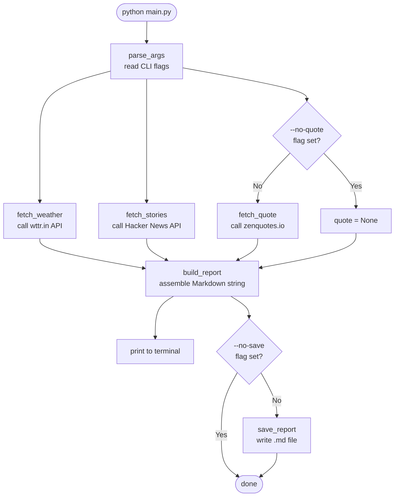

# daily_briefing

A beginner-friendly Python CLI that fetches weather, top Hacker News stories, and a motivational quote — then prints (and optionally saves) a Markdown report.

---

## Project Structure

```
daily_briefing/
├── app/
│   └── main.py          ← all the Python code lives here
├── docker/
│   └── Dockerfile       ← recipe for packaging the app in a container
├── requirements.txt     ← Python packages to install
└── README.md
```

---

## How the Program Flows

This diagram shows what happens from the moment you run the script to the moment it finishes.



---

## Quick Start

### Run locally

```bash
# 1. Install dependencies
pip install -r requirements.txt

# 2. Run with defaults  (Tel Aviv, 5 stories, with quote, saves file)
python app/main.py

# 3. Customise
python app/main.py --city London --stories 7
python app/main.py --no-quote --no-save
python app/main.py --help
```

### Run with Docker

```bash
# Build the image  (run from the project root)
docker build -t daily-briefing -f docker/Dockerfile .

# Run with defaults
docker run --rm daily-briefing

# Pass CLI flags
docker run --rm daily-briefing --city "New York" --stories 3

# Save the report to your machine by mounting a volume
docker run --rm \
  -v "$(pwd)/briefings:/app/app/briefings" \
  daily-briefing --city London
```

---

## CLI Flags

| Flag | Type | Default | Description |
|---|---|---|---|
| `--city` | string | `Tel Aviv` | City name for weather |
| `--stories` | int | `5` | Number of HN stories (max 10) |
| `--no-quote` | boolean flag | off | Skip the motivational quote |
| `--no-save` | boolean flag | off | Print only, do not write a file |
| `--output` | path | `app/briefings/` | Folder to save `.md` files |

---

## Key Python Concepts Used

| Concept | Where in the code |
|---|---|
| `import` / stdlib vs third-party | top of `main.py` |
| Constants (`UPPER_SNAKE_CASE`) | `DEFAULT_CITY`, `WEATHER_URL`, … |
| Type hints (`-> dict \| None`) | every function signature |
| `try / except` error handling | all three fetcher functions |
| `requests.get()` HTTP calls | `fetch_weather`, `fetch_stories`, `fetch_quote` |
| List slicing (`list[:N]`) | `fetch_stories` |
| List comprehension | `valid = [s for s in raw if …]` |
| `lambda` anonymous function | `key=lambda s: s.get("score", 0)` |
| `sorted()` with `reverse=True` | `fetch_stories` |
| f-strings | `build_report` |
| `"\n".join(list)` | `build_report` |
| `pathlib.Path` | `save_report`, `BRIEFINGS_DIR` |
| `argparse` | `parse_args` |
| `if __name__ == "__main__"` guard | bottom of `main.py` |
